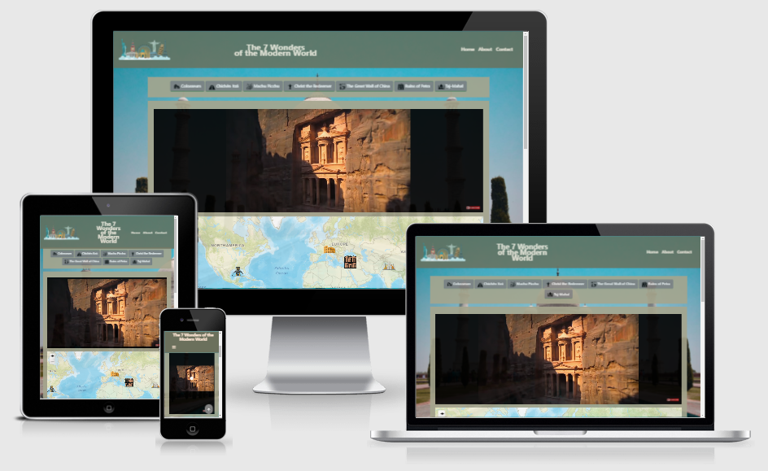

# The 7 Wonders of the Modern World

<a href='https://www.freepik.com/vectors/map'>Map vector created by channarongsds - www.freepik.com</a>

---

---

## Website
> Milestone 2 link to **The 7 Wonders of the Modern World**, [HERE](https://brunobdias.github.io/Ms2/).
>
> The purpose of this project is to demonstrate and promote the result of a campaing that started at 2000 and in July of 2007 elected 7 places as the  **The 7 Wonders of the Modern World**.

---

### Table of Contents
> [Overview](#overview)
>
> [UX](#ux)
>    - [Goals](#goals)
>        - [Visitor Goals](#visitor-goals)
>        - [Member Goals](#member-goals)
>        - [Business Goals](#business-goals)
>    - [Design Choices](#design-choices)
>        - [Fonts](#fonts)
>        - [Icons](#icons)
>        - [Colours](#colours)
>        - [Images](#images)
>    - [Wireframes](#wireframes)
>
> [Features](#features)
>    - [Existing Features](#existing-features)
>    - [Features Left to Implement](#features-left-to-implement)
>
> [Technologies Used](#technologies-used)
>
> [Testing](#testing)
>
> [Deployment](#deployment)
>    - [How to run this project locally](#how-to-run-this-project-locally)
>
> [Credits](#credits)
>    - [Content](#content)
>    - [Images](#images)
>    - [Code](#code)
>    - [Acknowledgements](#acknowledgements)

----
## Overview

> The project aims to bring some content as videos, descriptions of the places, some informations of the country where they are located, and help to promote tourism to the 7 places elected as wonders of modern world.

## UX
>## Goals
>### Visitor Goals <em>
> As a visitor, I want to:
> - "... research and find some astonishing place to travel to..."
> - "... easily navigate through the site using my PC or my mobile."
> - "... easily understand the site and learn more about the place I've decided to go."
> - "... find descriptions, media content about the destinations of my next trip."
> - "... see and find on the map where is the place."
> - "... find official content, webpages about the places, if avaiable"
> - "... learn about the country, your region, local currency, time zone, calling code, your borders and how populous is it."
> - "... find social media links."
> - "... get in touch with the site owner, asking for a personal project, to complaint or regard about the website"
> - "... find in more details about the content used on the website."
> </em>
>
>### Business Goals
>
> The Business goal is:
> - Provide a satisfying, interactive and instructive demonstration of the 7 wonders of the mordern world.
>
>### Design Choices
>#### Fonts
> - The selected font was [Roboto](https://fonts.google.com/specimen/Roboto) from **Google Fonts**.
>
>#### Icons
> The selected icons was found at:
> - [Fontawesome](https://fontawesome.com/)
> - [Icons8](https://icons8.com)
> - [Flaticon](https://www.flaticon.com/)
> - [Iconstout](https://iconscout.com/)
> - [hiclipart](https://www.hiclipart.com/)
>
>#### Colours
>
> - [Color Scheme](https://coolors.co/cb997e-ddbea9-ffe8d6-b7b7a4-a5a58d-6b705c)
> 
>    
> 
>#### Images
>
>
>
> - All images used are located at [images.md](images.md) file.
>
>### Wireframes
>
>The wireframes were created using [Balsamiq](https://balsamiq.com/) 
>
>
>

## Features
>  - The website main feature it is a interactive demonstration of the 7 wonders, through
pictures, share the social media channels and the official page of the places.
>
>### Features Left to Implement
> - Option to make login with a social media and add Comments and ratings to the place.
> - Button to share the place in social media.
> - Option to translate page to another language.

## Technologies Used
> - This project uses HTML, CSS and JavaScript.
>
> - [Jquery](https://jquery.com/)
>    - Developer used **Jquery** Library that helps to write JavaScript.
> - [Gitpod](https://gitpod.io/)
>    - Developer used **Gitpod** as IDE to build the website.
> - [Bootstrap](https://www.bootstrapcdn.com/)
>    - The project uses **Bootstrap** to simplify the development process  and make the website responsive easily.
>    - The project also uses Bootstrap to provide icons from [FontAwesome](https://www.bootstrapcdn.com/fontawesome/)
> - [Leafleat](https://leafletjs.com/)
>    - Developer used **Leafletjs** as open-source JavaScript library
for interactive maps.
> - [ESRI](https://esri.github.io/esri-leaflet/)
>    - Developer used **ESRI** as a set of tools for using ArcGIS services with **LeafletJS**.
> - [RestCountries](https://restcountries.eu/)
>    - Developer used **RestCountries** to get information about countries via a RESTful API.
> - [EmailJS](https://www.emailjs.com/)
>    - The **EmailJS** was used as email service, on the contact us section.
> - [Youtube](https://youtube.com/)
>    - Developer used **RestCountries** as resource providing videos to the page.
> - [Adobe Photoshop](https://photoshop.adobe.com/)
>    - The **Adobe Photoshop** was used to resize images.
> - [Google Fonts](https://fonts.google.com/)
>    - The project uses **Google fonts** to style the website fonts.
> - [GitHub](https://github.com/)
>    - This project uses **GitHub** to store and share all project code remotely.
> - [Balsamiq](https://balsamiq.com/)
>    - The Wireframes was created using **Balsamiq**.
> - [Coolors](https://coolors.co/)
>    - The **Coolors** was used to define the project color scheme.
> - [W3C HTML Validator](https://validator.w3.org/)
>    - The **W3C HTML Validator** was used to validate the project html.
> - [W3C CSS Validator](https://jigsaw.w3.org/css-validator/)
>    - The **W3C CSS Validator** was used to validate the project css.
> - [JSHINT](https://jshint.com/)
>    - The **JSHINT** was used to verify JavaScript code warning & error check.
> - [Web Page Test](https://www.webpagetest.org/)
>   - The **Web Page Test** was used to verify the website performance.
> - [Pixels Converter](https://pixelsconverter.com/px-to-rem)
>    - The **Pixels Converter** was used to change pixels to rem.
> - [Auto Prefixer](https://autoprefixer.github.io)
>    - The **Auto Prefixer** was used to parse the CSS and adds vendor prefixes.
> - [TinyPng](https://tinypng.com/)
>    - The **TinyPng** was used to compress all images used

## Testing
> - All informations about test are located at [testing.md](testing.md) file.

## Deployment
> - The project was developed using [Gitpod](https://gitpod.io/) commited to **git**,
  pushed to [GitHub](https://github.com/) and deployed at [GitHub Pages](https://pages.github.com/).
>
> - To deploy to [GitHub Pages](https://pages.github.com/) follow the next steps:
>   1. With your GitHub project open, under the project name there is a toolbar with the settings option, Click on "Settings" option. **IMPORTANT:** Your homepage HTML file must be called "index.html", and it must exist in the top-level directory.
>   2. Into the "Settings" page under the same toolbar, there is a list of pages on the left side of the page. Click on "Pages" option.
>   3. Into the "Pages" page, on the main page content there is a section called "Sources", you must choose the branch that holds the content that you want to be your website.
>   4. After selected your branch, click on "Save".
>   5. GitHub will show you the message "Your site is ready to be published at **yourdomainlink**", and after some minutes your page will be online and ready to be used.
> - The complete documentation about **GitHub Pages** Can be found [here](https://docs.github.com/en/github/working-with-github-pages/creating-a-github-pages-site).
>
>### How to run this project locally
> - To run this project locally you can clone, open with GitHub Desktop or download the project by opening the repository, clik on the [↓ Code] button:
>    - To Clone using URL, copy the provided repository link:
https://github.com/brunobdias/Ms2.git . When you **git clone**, to a remote repository using HTTPS URLs on the command line, Git will ask for your GitHub username and password. When Git prompts you for your password, enter your personal access token (PAT) instead.  or download.
>       - The complete documentation about **Clone** Can be found [here](https://docs.github.com/en/github/getting-started-with-github/about-remote-repositories)
>   - You can run this project locally by using a Git CLI clicking on "Open on GitHub Desktop"
>   - You can choose Download the ZIP project that provides a ZIP file which can be unzipped and used on your local machine.
>
>### Credits
> - [CodeInstitue](https://codeinstitute.net/)
> - [TravelTim](https://github.com/TravelTimN/)
> - [JymLynx](https://github.com/JimLynx)
> - [Balsamiq](https://balsamiq.com/)
> - [Fontawesome](https://fontawesome.com/)
> - [Google Fonts](https://fonts.google.com/)
> - [Coolors](https://coolors.co/)
> - [StackOverflow](https://stackoverflow.com/)
> - [w3Schools](https://www.w3schools.com/)
> - [Bootstrap](https://getbootstrap.com/)
> - [Jquery](https://jquery.com/)
> - [Gitpod](https://gitpod.io/)
> - [GitHub](https://github.com/)
> - [Leafleat](https://leafletjs.com/)
> - [ESRI](https://esri.github.io/esri-leaflet/)
> - [RestCountries](https://restcountries.eu/)
> - [EmailJS](https://www.emailjs.com/)
> - [Youtube](https://youtube.com/)
> - [Mozilla.org](https://developer.mozilla.org/)
> - [Unsplash](https://unsplash.com)
> - [Auto Prefixer](https://autoprefixer.github.io)
> - [TinyPng](https://tinypng.com/)
> - [Hiclipart](https://www.hiclipart.com/)
> - [Codegrepper](https://www.codegrepper.com/)
> - [Mdbootstrap](https://mdbootstrap.com/)
>
>### Code
> The code were developed on [Gitpod](https://gitpod.io/) hosted at [GitHub](https://github.com/) and deployed at [GitHub Pages](https://pages.github.com/), written  based at previous classes at [CodeInstitue](https://codeinstitute.net/),
 with the assistance of [Tim Nelson](https://github.com/TravelTimN) and your Leaflet map samples, [Jim Morel](https://github.com/JimLynx) your tips and contents to milestone projects and your Safari project avaiable, [Aukje van der Wal](https://github.com/byIlsa) for your call and assitance on handling Api's, [w3Schools](https://www.w3schools.com/), [StackOverflow](https://stackoverflow.com/),
 [Bootstrap](https://getbootstrap.com/), and all other links credited, as comments over all code are located [HERE](helpCredits.md) with documentation, tips and samples to understand some resourses and to help on bug fixes.
 
## Acknowledgements
> Special thanks to: 
> - My Mentor [Spencer Barriball](https://github.com/5pence) from Code Institute for his time, support, assistance and expertise in explaining and guide me through 
 the milestone project.
> - The Student Care Team from Code Institute, 
 to [Tim Nelson](https://github.com/TravelTimN),
 [Jim Morel](https://github.com/JimLynx) and
 [Aukje van der Wal](https://github.com/byIlsa)
 from all provided content, samples and calls to assist all fellow students.
>
>### Disclaimer
> - The content of this website, including the images used, are for educational purposes only.
