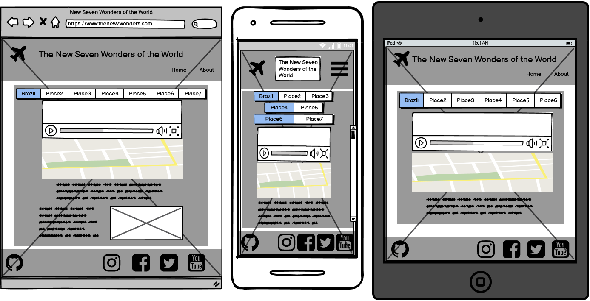

<a href='https://www.freepik.com/vectors/map'>Map vector created by channarongsds - www.freepik.com</a>

# The 7 Wonders of the Modern World

## Table of Contents
> [UX](#ux)
>    - [Goals](#goals)
>        - [Visitor Goals](#visitor-goals)
>        - [Member Goals](#member-goals)
>        - [Business Goals](#business-goals)
>    - [Design Choices](#design-choices)
>        - [Fonts](#fonts)
>        - [Icons](#icons)
>        - [Colours](#colours)
>        - [Images](#images)
>    - [Wireframes](#wireframes)
>
> [Features](#features)
>    - [Existing Features](#existing-features)
>    - [Features Left to Implement](#features-left-to-implement)
>
> [Technologies Used](#technologies-used)
>
> [Testing](#testing)
>
> [Deployment](#deployment)
>    - [How to run this project locally](#how-to-run-this-project-locally)
>
> [Credits](#credits)
>    - [Content](#content)
>    - [Images](#images)
>    - [Code](#code)
>    - [Acknowledgements](#acknowledgements)

----

# UX
>## Goals
>### Visitor Goals
> As a visitor, I want to:
> - Be able to easily navigate and find vital content.
> - Easily understand the site and learn more about the wonders of the world.
> - Be able to find description media content of the destinations.
> - Be able to see on the map where it is the place.
> - Be able to find official content webpages about the places.
> - Be able to find social media links.
> - Be able to get in touch through contact page. **
> - Be able to see the page in english or portuguese. **
>
>### Business Goals
>
> The Business goal is:
> - Provide a satisfying, interactive and instructive demonstration of the 7 wonders of the mordern world.
>
> ** This Goals are listed at Features section as Future Implements

### Design Choices
>#### Fonts
> - The selected font was [Roboto](https://fonts.google.com/specimen/Roboto) from **Google Fonts**.
>
>#### Icons
> The selected icons was found at:
>  [Fontawesome](https://fontawesome.com/)
>  [Icons8](https://icons8.com)
>  [Flaticon](https://www.flaticon.com/)
>  [Iconstout](https://iconscout.com/)
>  https://www.hiclipart.com/free-transparent-background-png-clipart-izyki
>
>#### Colours
>
> - [Color Scheme](https://coolors.co/cb997e-ddbea9-ffe8d6-b7b7a4-a5a58d-6b705c.
> 
>    
> 
>#### Images
>
>
>
> - All images used are located at [images.md](images.md) file.
>
>### Wireframes
>
>The wireframes were created using [Balsamiq](https://balsamiq.com/) 
>
>
>

## Features
>  - The website main feature it is a interactive demonstration of the 7 wonders, through
pictures, share the social media channels and the official page of the places.

### Features Left to Implement
 
## Technologies Used

>- This project uses HTML, CSS and JavaScript.
>
> - [Gitpod](https://gitpod.io/)
>    - Developer used **Gitpod** as IDE to build the website.
> - [Bootstrap](https://www.bootstrapcdn.com/)
>    - The project uses **Bootstrap** to simplify the development process  and make the website responsive easily.
>    - The project also uses Bootstrap to provide icons from [FontAwesome](https://www.bootstrapcdn.com/fontawesome/)
> - [Google Fonts](https://fonts.google.com/)
>    - The project uses **Google fonts** to style the website fonts.
> - [GitHub](https://github.com/)
>    - This project uses **GitHub** to store and share all project code remotely.
> - [Balsamiq](https://balsamiq.com/)
>    - The Wireframes was created using **Balsamiq**.
> - [Coolors](https://coolors.co/)
>    - The **Coolors** was used to define the project color scheme.
> - [W3C HTML Validator](https://validator.w3.org/)
>    - The **W3C HTML Validator** was used to validate the project html.
> - [W3C CSS Validator](https://jigsaw.w3.org/css-validator/)
>    - The **W3C CSS Validator** was used to validate the project css.
> - [Pixels Converter](https://pixelsconverter.com/px-to-rem)
>    - The **Pixels Converter** was used to change pixels to rem.
> - [Auto Prefixer](https://autoprefixer.github.io)
>    - The **Auto Prefixer** was used to parse the CSS and adds vendor prefixes.
> - [TinyPng](https://tinypng.com/)
>    - The **TinyPng** was used to compress all images used

## Testing
> - All informations about test are located at [testing.md](testing.md) file.

## Deployment
> - The project was developed using [Gitpod](https://gitpod.io/) commited to **git**,
  pushed to [GitHub](https://github.com/) and deployed at [GitHub Pages](https://pages.github.com/).
>
> - To deploy to [GitHub Pages](https://pages.github.com/) was used the these steps 
 [here](https://docs.github.com/en/github/working-with-github-pages/creating-a-github-pages-site).

### How to run this project locally

### Credits
> - [CodeInstitue](https://codeinstitute.net/)
> - [Balsamiq](https://balsamiq.com/)
> - [Fontawesome](https://fontawesome.com/)
> - [Google Fonts](https://fonts.google.com/)
> - [Coolors](https://coolors.co/)
> - [StackOverflow](https://stackoverflow.com/)
> - [w3Schools](https://www.w3schools.com/)
> - [Bootstrap](https://getbootstrap.com/)
> - [Gitpod](https://gitpod.io/)
> - [GitHub](https://github.com/)
> - [Unsplash](https://unsplash.com)
> - [Auto Prefixer](https://autoprefixer.github.io)
> - [TinyPng](https://tinypng.com/)
> - [Hiclipart](https://www.hiclipart.com/)

### Code
> - The code were developed on [Gitpod](https://gitpod.io/) hosted at [GitHub](https://github.com/) and deployed at [GitHub Pages](https://pages.github.com/), written  based at previous classes at [CodeInstitue](https://codeinstitute.net/),
 with the assistance of [Tim Nelson](https://github.com/TravelTimN) and your Leaflet map samples, [Jim Morel](https://github.com/JimLynx) your tips and contents to milestone projects and your Safari project avaiable, [Aukje van der Wal](https://github.com/byIlsa) for your call and assitance on handling Api's, [w3Schools](https://www.w3schools.com/), [StackOverflow](https://stackoverflow.com/),
 [Bootstrap](https://getbootstrap.com/), with documentation and samples to understand some resourses and to help on bug fixes.
 
## Acknowledgements
> Special thanks to: 
> - My Mentor [Spencer Barriball](https://github.com/5pence) from Code Institute for his time, support, assistance and expertise in explaining and guide me through 
 the milestone project.
> - The Student Care Team from Code Institute, 
 to [Tim Nelson](https://github.com/TravelTimN),
 [Jim Morel](https://github.com/JimLynx) and
 [Aukje van der Wal](https://github.com/byIlsa)
 from all provided content, samples and calls to assist all fellow students.

### Disclaimer
> - The content of this website, including the images used, are for educational purposes only.
