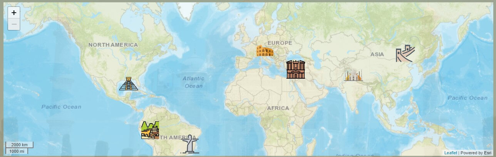

## Project development walkthrough
> - The idea of the Ms2 project came from a Travel page project, and how
make fit on the project dead line, I decided to found something more static and less dynamic with limited options of places, so the 7 wonders of the world, seems to be a good option, from this point I discovered about the 7 Wonders of the modern world, which I've never paid attention to, that we had 7 wonders of the ancient world, and now we have the 7 wonders of modern world. That locked a nice place to kick-off the project.
> - When I started the development process, I've think on the wireframe, the user stories, start the readme and started coding.
> - My first challenge were with some effects when scrolling the page to shrink the navbar, solved checking some samples.
> - Then implement the youtube IFrame videos and make then resposive without leak the container size, solved with the mentor helps and some research on stackoverflow.
> - With the map several of challenges happened, after the Hackton 2021 ST. Patricks day, I've decided to use the leafleatJs map instead of The Google Maps, the idea was approved and encouraged by my Mentor, besides it is an opensource solution, not involving the use of your credit card. Following the quickstart of LeafletJS page it seems easy and works just fine, I've created an account on Mapbox and start using this Api Map service, but that its a limited map service to free acount, besides of it, it was realy hard to customize the map and fit on different sizes and make it responsive, then after a long time spent trying to make this works I decided to look on Slack community when I came across two good source of samples and Ideas, that was Tim Nelson Sample project on trying leaflet and the Jym Lynx Safari project that used the leaflet map as well; That moment was the table turn on the leaflet map exploring, I've changed the map service source to a public source that was the ESRI feat Arcgis, this with some code snippets, samples and Ideas, I've been able to overcome the map challenge.
> - The next challenge were with the Rest Countries Api, and how format and manipulate the return values of the api, after some time spent some research have helped with it. One still non solved issue it is the country border list, that is all countries displayed are abreviated, that doesn't look good, but I couldn't overcome this in time to deliver the project.
> - The contact page sugested by the Mentor wasn't hard, the code instute class about how integrate the email with EmailJs were pretty useful, and thankfully that went pretty good.
> - Then I've made choice to create a better user experience, creating minor features to help, as stick the toolbar to the navbar and having no need to scroll to top every time that he needs change the place, or the button back to top.

---

## Validations
> --- 
> [validator.w3.org](https://validator.w3.org/nu/?doc=https%3A%2F%2Fbrunobdias.github.io%2FMs2%2Findex.html)
> - 3 warnings about heading missing, I'm populating this headings 
> on functions of JavaScript.
> 
> [jigsaw.w3.org](https://jigsaw.w3.org/css-validator/validator?uri=https%3A%2F%2Fbrunobdias.github.io%2FMs2%2Findex.html&profile=css3svg&usermedium=all&warning=1&vextwarning=&lang=en)
>
> - 19 Errors on following URI's
>   - URI : https://cdn.jsdelivr.net/npm/bootstrap@5.0.0-beta1/dist/css/bootstrap.min.css
>   - URI : https://unpkg.com/leaflet@1.7.1/dist/leaflet.css
> - 486 Warnings on following URI's
>   - URI : https://unpkg.com/leaflet@1.7.1/dist/leaflet.css
>   - URI : https://brunobdias.github.io/Ms2/assets/css/style.css
>    //Caught after Autofix
>   - URI : https://cdn.jsdelivr.net/npm/bootstrap@5.0.0-beta1/dist/css/bootstrap.min.css
>   - URI : https://use.fontawesome.com/releases/v5.15.1/css/all.css
>
> webpagetest.org
> - Web Page Test [here](https://www.webpagetest.org/result/210419_AiDcXX_4ba5a965730bcd808c5db4541ba90bf8/1/details/#waterfall_view_step1).
>
> ---
## Testing 

>### Browser Compatibility
>   - Compatible and tested with Google Chrome, Brave, Microsoft Edge, Moozila Firefox, Opera.
>
>  - Note: This website it is **Not compatible with the browser Internet Explorer 11 and your previous versions**.
> ---
>### User Stories
> As a visitor, I want to:
> - _"... research and find some astonishing place to travel to..."_
>   - All places are displayed with animated, interactive and user experience driven thinking;
> - _"... easily navigate through the site using my PC or my mobile."_
>   - All website navigation is intuitive;
>       - On PC:
>           - There is the navbar option to navigate through the page;
>           - The place selector toolbar to navigate through the places avaiable it is located below navbar and when using on PC screen the toolbar it is sticked on top, to improve the user experience when navigating through the places;
>           - The content section allow hide or show the place description or the country details;
>           - After scroll down the page the button "back to top" [↑] it is displayed;
>       - On Mobile:
>           - There is the navbar option to navigate the logo is hidden and the navbar options are collapsed into a burger button;
>           - The place selector toolbar to navigate through the places avaiable it is located below navbar, when using on a mobile screen the toolbar it is not stick on top, to improve the user experience when navigating through the page releasing more screen space to watch the video, check the map or read the descriptions;
>
> - _"... easily understand the site and learn more about the place I've decided to go."_
>   - All website navigation is intuitive and easy to learn how you do it;
>   - All places have some description preview, if avaiable from official web pages, a video if avaiable filmed by drone, customized pin on map and some country details plus official and social media links from the place (When avaiable);
> - _"... find descriptions, media content about the destinations of my next trip."_
>   - All places have a description preview, a video, map with customized pin on and some country details, official and social media links from the place;
>
> - _"... see and find on the map where is the place."_
>   - When the place is selected, the map fly to the place pin.
> - _"... find official content, webpages about the places, if avaiable"_
>   - When the place is selected, the official website and the avaiables social media links are displayed on the bottom of content section;
> - _"... learn about the country, your region, local currency, time zone, calling code, your borders and how populous is it."_
>   - When the place is selected, below the place description some information of country are displayed as capital, region, sub-region, time zone, local currencie, calling code, border countries, current population, and the country flag;
> - _"... find social media links."_
>   - When the place is selected, the official website and the avaiables social media links are displayed on the bottom of content section;
> - _"... get in touch with the site owner, asking for a personal project, to complaint or regard about the website"_
>   - On the navbar and on the bottom of the page there is a contact form, where when informed name, email and the comment, this message will be sent to the developer.
> - _"... find in more details about the content used on the website."_
>   - On the page footer there is some content links about the website as the github link of the project the README link as the images used on development.
>---
> ### On PC Screen
>---
> #### Navbar
> 

>
>Expanded Navbar
> Figure 1
>  
>
>Collapsed Navbar
> Figure 2
> 

>
> - Expanded Navbar: When on top of the page the navbar stay at full size, and with the logo visible;
> - Collapsed Navbar: After scroll the page there is a effect control to hide the logo and collapses the navbar, expanding and showing the logo when roll to top again.
> ---
> #### Toolbar
> 

>
> Places Selector
>
>   Figure 3
> 

>
>  - The Toolbar is sticky at the top on PC Screens, and allows you to navigate through the places availables on website.
>
> ---
> #### Section - Content - About
> 

>
> Video about all 7 Wonders
>
>   Figure 4  
>
> All places on map
>
>   Figure 5
> 

>
> - When the page is loaded at first time the about content is the loaded to be displayed, with a video about all 7 wonders of modern world, and all 7 wonders are displeyd on map.
> ---
> 

>
> About Description Visible
>
>
>   Figure 6
> 

>
> 

>
> About Description Hidden
>
>   Figure 7
> 

>
> - The about content is displayed when the page is loaded at first time and will only be displayed again when clicked at the navbar "About" link, that will load again the about content and scroll the screen to the about description.
> - The Hide Description button displayed below the description hide or show the description.
> ---
> #### Section - Content - Place Selected
> 

>
> Place Selected Video and Map 
>
>   Figure 8
>
> 

>
> - When the place is selected the respective video, and content is loaded to be displayed, the map is centered on the place selected pin.
>---
> #### Section - Content - Place Selected
> 

>
> Description and Country Details Visible 
>
>   Figure 9  
>
> Description and Country Details Hidden
>
>
>   Figure 10
> 

>
> - When the place is selected the description of the place and country are loaded, with the Country details Hidden at first time, and the country details remains the way you let it even when you select another place, while the description is always displayed when selected another place.
> - And both section can be hidden if desired. As on Figure 10.
>---
> #### Section - Contact
> 

>
>
>   Figure 11
> 

>
> - The contact section can be found by scrolling the page to the bottom or clicking on "Contact" link on navbar, that will scroll the page to the bottom.
>---
> #### Footer
> 

>
>
>   Figure 12
> 

>
> - On the page footer there is some content links about the website as the github link of the project the README link as the images used on development.
> - On the right corner there is a gray button with an arrow up, that is the back to top button, that scrolls the page back to top.
>---
> ### On Mobile Screen
>---
>
> - The main Diference between PC and Mobile Screen is that the logo is hidden on mobile and the toolbar to select places it is not sticked on top, to allow the user to have a better view of the contents.
>---
> 

>
> Navbar - Toolbar - Video About all 7 wonders
>
>
>
> Navbar Collapse - Map Centered
>
>
> 
> About Description Visible
>
>
>
> About Description Hidden
>
>
> 
> Place selected Map and Description 
>
>
>
> Place selected Country Details
>
>
> 
> Section Contact and Footer
>
>
> 

>
>---